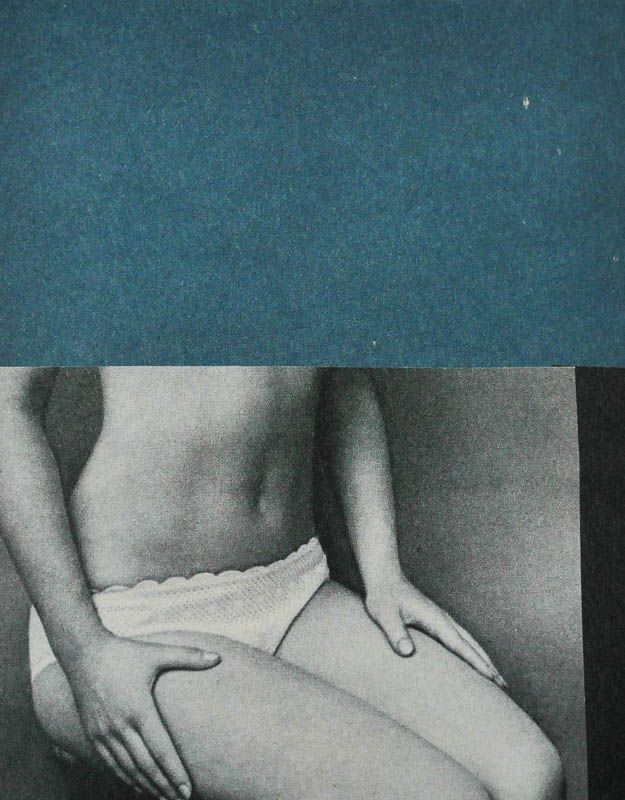
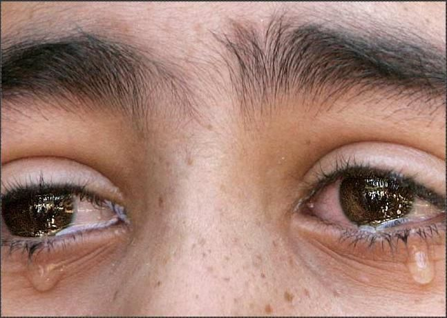
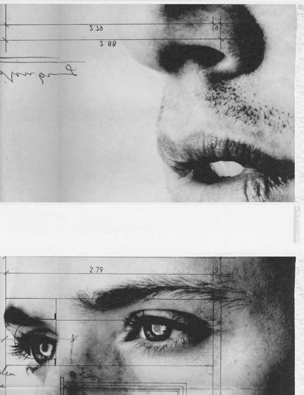
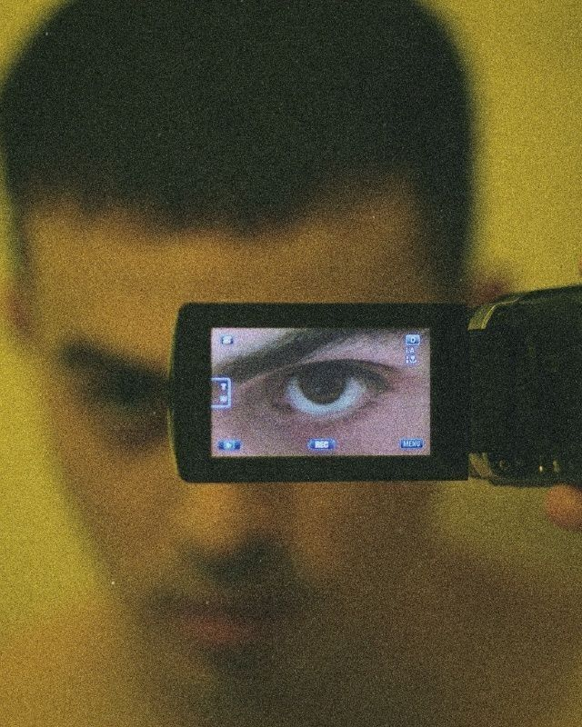

# websit-IVAN

<!DOCTYPE html>
<html lang="ru">
# Основа
<head>
    <meta charset="UTF-8">
    <meta name="viewport" content="width=device-width, initial-scale=1.0">
    <title>IVAN</title>
    <link rel="stylesheet" href="styles.css">
    <link href="https://fonts.googleapis.com/css2?family=Montserrat:wght@100&display=swap" rel="stylesheet">
</head>
# Заголовок
<body>
    <header>
        <h1>IVAN</h1>
    </header>
    <main>
        <section class="gallery">
           #Добавление фото
            

                
            

            

                
            

            

                
            

            

                
            

            

                
            

            

                
            

            

                
            

            

                
            

            

                
            

            

                
            

            

                
            

            

                
            

            
        </section>
    </main>
    <footer>
        
&copy; 2025. Все права защищены Дениской.

    </footer>
</body>
</html>

# Стиль сайта # Тело body {
    font-family: Arial, sans-serif;
    margin: 0;
    padding: 0;
    background-color: #7b917b;
}
# Задний фон body::after {
    content: "";
    position: absolute;
    top: 0;
    left: 0;
    right: 0;
    bottom: 0;
    background-image: url('IceShot.jpg');
    background-size: cover;
    background-position: center;
    opacity: 0.4; /* прозрачность только фона */
    z-index: -1; /* чтобы картинка была за содержимым */
  }

# Шрифт заголовка header h1 {
    font-family: 'Montserrat', sans-serif;
    font-size: 80px; /* размер можно менять */
    font-weight: 100; /* ТОНКИЙ шрифт */
    text-align: center;
    margin: 0;
    line-height: 2.5;
}

# .gallery {
    display: flex;
    justify-content: center;
    flex-wrap: wrap;
    gap: 20px;
    padding: 20px;
}

# Размеры фото.photo {
    width: 200px;
    height: 300px;
    border-radius: 20px;
    box-shadow: 0 16px 16px rgba(0, 0, 0, 0.80);
    position: relative;
    overflow: hidden;
}

# Анимации .photo img {
    width: 100%;
    height: 100%;
    object-fit: cover;
    transition: transform 0.25s ease-in-out, opacity 0.25s ease-in-out;
}
# Открытое фото
     /* увеличенное фото */
    .photo:hover img {
    position: fixed;
    top: 50%;
    left: 50%;
    width: auto;
    height: auto;
    max-width: 40vw; /* уменьшенный размер */
    max-height: 50vh;
    transform: translate(-50%, -50%) scale(1);
    z-index: 1000;
    border-radius: 15px;
    box-shadow: 0 20px 20px rgba(0, 0, 0, 1);
    pointer-events: none;
}

# as.photo:hover img {
    animation: appear 0.25s ease-in-out;
    }
    @keyframes appear {
    0% {
        transform: translate(-50%, -50%) scale(0.8);
        opacity: 0;
    }
    100% {
        transform: translate(-50%, -50%) scale(1);
        opacity: 1;
    } 
  }

# Необязательно footer {
    
    color: black;
    padding: 8px;
    margin-top: 16px;
}
